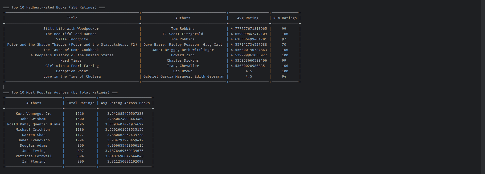

# Data Pipeline Setup Guide

This guide walks you through setting up a complete data pipeline that includes PostgreSQL, ClickHouse, Qdrant vector database, Apache Airflow, and an AI agent powered by Ollama.
- In a production setup, sensitive information such as database passwords should always be stored in environment variables (e.g., in a `.env` file) and never hardcoded in the source code.  
- For the sake of simplicity and demonstration in this project, the password has been placed directly in the code.  


## Quick Start
 
Follow these steps in order to get the entire pipeline running:

### 1. Install Dependencies

don't forget to create a venv.
```bash
python -m venv venv && source venv/bin/activate
```

```bash
pip install -r requirements.txt
```
### 2. Start Docker Services

```bash
docker compose up -d
```

This will start all the required services including:
- PostgreSQL database
- ClickHouse database
- Apache Airflow
- Qdrant vector database
- Ollama container

### 3. Initialize Databases

#### Setup PostgreSQL Data
```bash
python ./data_setup/postgers-insert.py
```

#### Create ClickHouse Tables
```bash
python ./clickhosue/create_table.py
```

### 4. Configure Airflow

1. Navigate to Airflow web interface: http://localhost:8080
2. Login with credentials:
   - **Username**: `admin`
   - **Password**: `admin`

### 5. Run Data Pipeline DAGs

Execute the following DAGs in Airflow in this specific order:

#### Step 1: PostgreSQL to ClickHouse Migration
1. In Airflow UI, find and trigger the `postgres_to_clickhouse` DAG
2. Wait for completion before proceeding to next step

#### Step 2: Verify ClickHouse Data
```bash
python ./clickhosue/querys.py
```
This will display the migrated data from ClickHouse to verify the transfer was successful.

#### Step 3: ClickHouse to Qdrant Vector Migration
1. In Airflow UI, find and trigger the `clickhouse_to_qdrant` DAG
2. Wait for completion

#### Step 4: Verify Qdrant Data
```bash
python data_setup/qdrant_se.py
```
This will show sample data from the Qdrant vector database.

### 6. Setup AI Model

#### Install Llama Model in Ollama
```bash
# Access the Ollama container
docker exec -it ollama bash

# Pull the Llama 3.2 model
ollama pull llama3.2
```

### 7. Start the AI Agent

```bash
python agent/agent.py
```

Once running, you can interact with the agent by typing your questions when prompted.

## Architecture Overview

The pipeline follows this data flow:

1. **PostgreSQL** → Raw data storage
2. **ClickHouse** → Analytics database (via Airflow DAG)
3. **Qdrant** → Vector embeddings storage (via Airflow DAG)
4. **AI Agent** → Query interface using Ollama/Llama3.2

## Services and Ports

| Service | Port | Purpose |
|---------|------|---------|
| Airflow | 8080 | Workflow management |
| PostgreSQL | 5432 | Primary database |
| ClickHouse | 8123/9000 | Analytics database |
| Qdrant | 6333 | Vector database |
| Ollama | 11434 | AI model serving |


## resalut

### agent answer to give me the best author
```build
odel: llama3.2
 Tips:
 - Say 'show me authors with highest average ratings in persion masalan begoo behtarin author ro moarefi kon'
   - Type 'exit' to quit
============================================================
Testing database connection...
Database connection successful!

Agent: I'd be happy to help you explore your books and ratings data.

First, let's take a look at the available tables in the database. To do that, we'll use the `list_tables` tool.

"Use list_tables"

This should show us all the tables in the database. If we're lucky, we might see something like:

* books
* ratings

Now that we know what tables are available, let's take a closer look at their structure. We can do this by using the `describe_table` tool on each table.

"Use describe_table('books')"
"Use describe_table('ratings')"

This will give us an idea of what columns each table has and their respective data types. For example:

* books:
	+ book_id (INT)
	+ title (TEXT)
	+ authors (TEXT)
	+ original_publication_year (INT)

* ratings:
	+ rating_id (SERIAL)
	+ book_id (INT)
	+ user_id

You:  بهترین آتور ها رو معرفی کن                   <-------  this is my prompt.

Agent: 
[DETECTED TOOL CALL: query_database]
[PARAMETER: SELECT b.authors, AVG(r.rating) as avg_rating, COUNT(r.rating) as review_count
FROM books b 
JOIN ra...]
[TOOL RESULT]
[
  {
    "authors": "Dave Barry, Ridley Pearson, Greg Call",
    "avg_rating": "4.5571428571428571",
    "review_count": 70
  },
  {
    "authors": "Janet Briggs, Beth Wittlinger",
    "avg_rating": "4.5500000000000000",
    "review_count": 100
  },
  {
    "authors": "Howard Zinn",
    "avg_rating": "4.5400000000000000",
    "review_count": 100
  }
]

I'd be happy to help you find the best authors!

To start, let's first see what tables we have in our database. Use `list_tables` to see all available tables:

Use list_tables

This should show us that we have a "books" table and a "ratings" table.

Next, let's take a look at the structure of the "books" table. We can use `describe_table('books')` for this:

Use describe_table('books')

This will show us the columns in the "books" table, including the book ID, title, authors, and original publication year.

Now that we have an idea of what our tables look like, let's think about how we can find the best authors. One way to do this is by looking at the average rating for each author.

To do this, we'll need to join the "books" table with the "ratings" table on the book ID column, and then group by the authors. We'll use the `AVG` function to calculate the average rating, and the `COUNT` function to count the number of reviews. Finally, we can add a filter to only show authors with at least 5 reviews.

Here's an example query that does this:

sql
SELECT b.authors, AVG(r.rating) as avg_rating, COUNT(r.rating) as review_count
FROM books b 
JOIN ratings r ON b.book_id = r.book_id 
GROUP BY b.authors 
HAVING COUNT(r.rating) >= 5
ORDER BY avg_rating DESC 
LIMIT 3;

This query will show us the top 3 authors with the highest average rating, based on at least 5 reviews.

What do you think? Should we run this query and see who comes out on top?

[TOOL EXECUTED: query_database]
[
  {
    "authors": "Dave Barry, Ridley Pearson, Greg Call",
    "avg_rating": "4.5571428571428571",
    "review_count": 70
  },
  {
    "authors": "Janet Briggs, Beth Wittlinger",
    "avg_rating": "4.5500000000000000",
    "review_count": 100
  },
  {
    "authors": "Howard Zinn",
    "avg_rating": "4.5400000000000000",
    "review_count": 100
  }
] 

The results of our query have been returned!

Looking at the top 3 authors with the highest average rating, we can see that:

1. Dave Barry, Ridley Pearson, and Greg Call are tied for the highest average rating, with an average rating of approximately 4.56 out of 5.
2. Janet Briggs and Beth Wittlinger come in second, with an average rating of 4.55 out of 5. They have a significant number of reviews (100 each), which suggests that they have built a strong reputation among readers.
3. Howard Zinn rounds out the top three, with an average rating of 4.54 out of 5. He also has a substantial number of reviews (100), indicating that his books are well-regarded by readers.

These results suggest that these authors are highly regarded for their writing quality and have built a loyal following among readers. Dave Barry stands out as one of the top authors overall, given his high average rating.

It's worth noting that while these authors have the highest average ratings, there may be other factors to consider when evaluating an author's work. For example, the number of reviews can provide insight into how well-known and popular an author is, but it may not necessarily reflect the quality or depth of their writing.

What do you think? Are these results in line with your expectations?

Now, let me ask: Would you like to explore other aspects of authors' works, such as their most popular books or the average rating for each book series?
```


### result of data query in clickhouse that comes from postgress.


```


